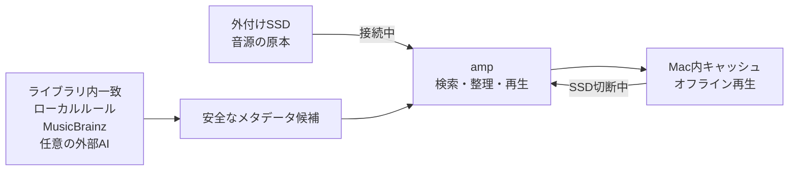

# amp

<p align="center">
  
</p>

<p align="center">
  <a href="README.md">English</a> | 日本語
</p>

ampは、大規模なローカル音楽コレクションを丁寧に育てたい人のためのmacOS音楽プレイヤーです。原本は外付けSSDに置いたまま、SSDを外したときはMac側の保護キャッシュから再生を継続でき、音源をストリーミングサービスへ預けずに、繰り返しのメタデータ整理を必要な範囲だけ自動化できます。

> 現在のリリースはApple Silicon向けです。配布バイナリはアドホック署名で、Appleによる公証は行っていません。

## 音楽コレクションの主導権を手元に

### 外付けストレージを原本保管先のまま使える

音楽コレクション全体をMacへ複製せず、外付けSSDをメイン保管先にできます。SSDを外してもライブラリ情報は残り、接続状態を画面で確認できます。再接続すると、元の音源ファイルを使う状態へ戻ります。

### 大切な曲をオフラインへ持ち出せる

設定した上限の範囲で、再生可能なコピーをMacへ自動キャッシュします。お気に入りとプレイリストの曲は通常のキャッシュ整理から保護されるため、自分で選び整理した曲は、メイン保管先を接続していないときも再生できます。

### 管理を自動化しても、音源の安全性は手放さない

必要な処理だけをチェックして動かせます。ジャンルの英語標準表記への統合、MusicBrainzによるトラック／ディスク番号候補、未登録のリリース年、文字表記の安全な正規化、未分類ジャンルの判定に対応します。ジャンル判定はライブラリ内の一致、ローカルルール、MusicBrainz、任意で設定した外部AIの順に確認します。自動判定で既存ジャンルを上書きせず、AIへ音声を送信しません。ファイル編集は作業コピーへの書き込みと検証を経てから原本へ反映します。



## 特長

### 大規模ライブラリ

- SQLite／GRDBとFTS5を使った検索、ソート、ページング
- 37万曲規模でも全曲を一度にメモリへ読み込まない設計
- MP3、M4A、WAV、FLACのスキャンと再生
- 曲、アルバム、アーティスト、ジャンル、フォルダ、お気に入り、最近追加した曲を横断して閲覧
- 曲／アルバムのリリース年列と、アーティストごとの代表ジャンル列を必要に応じて表示
- 曲一覧・アルバム一覧・アーティスト一覧における表示列のドラッグ＆ドロップ並び替え、表示／非表示、列幅を自動保存
- シームレスなShazam連携：曲の再生と同時にMacのShazamアプリを起動し、聞き取りモードを自動開始
- サイドバー左下にジャンル判定やリリース年自動取得のリアルタイム進捗ステータスを常時表示
- アーティスト一覧へ戻った際のスクロール位置を復元
- インクリメンタル検索中もキーボードフォーカスを維持し、入力前から十分な幅の検索欄を表示
- 初期状態は簡潔なライブラリ項目にしつつ、保存済みの表示／非表示と並び順はすべて維持

### メタデータ診断と修復・表記ゆれ統一・コメント一括削除

- 破損・未再生可能（0バイトや音声データ破損）ファイルの自動検出と一覧表示
- 実ファイルからのメタデータ・曲長再解析による自動修復
- 修復不可能な破損ファイルをゴミ箱へ移動してライブラリから一括除外・削除
- 表記ゆれの一括統一時に、リアルタイムな曲数カウント、プログレスバー、実行中スピナーを表示
- 重複曲、欠損値、文字化け候補、URL混入、不要なコメントの検出と診断
- Shazam連携による音声再生と聞き取りで文字化け曲を素早く特定・修復
- ワンクリックでの曲ごとのコメント削除、および表示中ページの一括コメント消去

### 外付けSSD中心の運用とオフライン再生

- メイン保管先の接続状態をサイドバーへ表示
- SSDが外れていてもライブラリのメタデータを保持
- 再生曲をMac側へ自動キャッシュし、接続時は原本、切断時はキャッシュから再生
- お気に入りとプレイリスト内の曲はLRU整理の対象外として保護
- SSD切断中に取り込んだ曲をMacへ一時保管し、再接続後に移動
- キャッシュ、差分、保管先、取り込み状態を「設定と管理」に集約

### 再生とギター練習

- 右ペイン上部に常設した再生コントロール
- ジャケット／曲名から現在のアルバムへ、アーティスト名からアーティストページへ移動。アルバム遷移はアルバムアーティストを優先し、元の閲覧状態を維持
- ランダム、一曲リピート、アルバム／プレイリストリピート。接続中はライブラリ全体、切断中は再生可能なキャッシュ全体からランダム再生
- 60〜95%の5%刻みと100%の再生速度
- 再生速度を維持したまま半音下げ／原音／半音上げ
- 曲ごとに3枠保存できるA–B区間リピート
- 練習設定と区間をアプリ終了後も復元
- 埋め込みBPMを読み出すかローカル解析し、曲ごとの結果を「練習」タブへ保存
- 現在の曲名とアーティスト名からギター／ベースのTAB動画をYouTube検索
- Chordifyを表示する「コード」タブと内蔵ブラウザの戻る操作
- 右ペインのプレイヤーと操作表現を揃えた固定サイズのミニプレイヤー

### 曲情報と発見

- 右ペインに曲情報、歌詞、発見、練習、コードを表示
- 未再生時は話題の曲、YouTube、音楽ニュースへのリンクを表示
- YouTubeや外部記事を内蔵ブラウザで開き、情報へ戻る際はメディアを停止
- 外部記事の自動翻訳は「表示」設定または内蔵ブラウザ上の状態表示をクリックしてオン／オフでき、現在のページへ即時反映
- 埋め込みジャケットを優先し、取得できない場合は外部アートワークへフォールバック
- 歌詞のキャッシュ、追加、修正と、再生に合わせた同期歌詞の自動スクロール

### プレイリストと操作

- プレイリスト作成、削除、ドラッグ並び替え、ダブルクリックでの名前変更
- M3U／M3U8の読み込みと書き出し
- Shift／Commandクリックによる複数選択
- 複数曲をまとめてお気に入りやプレイリストへ追加
- 空のプレイリストでも表示が点滅しない安定した空状態
- ライブラリ項目の表示／非表示と並び替え

### メタデータの安全な自動整理と編集

- MP3、M4A、WAVファイルのタイトル、アーティスト、アルバム、アルバムアーティスト、ジャンル、トラック番号、ディスク番号、コメントを編集
- アーティスト、アルバム、アルバムアーティスト、ジャンル、ディスク番号、コメントの一括編集
- 自動整理は必要な機能のみオンにして常時実行。個別の開始／停止ボタンは不要
- 日本語・表記ゆれジャンル名を英語の標準表記に統合（大文字小文字・記号・中黒・ハイフン対応）
- MusicBrainzおよびWeb/AI情報源からのアルバムリリース年補完
- 作業コピーへの書き込み・読み戻し・検証を行ってから原本を置換する安全設計
- 編集失敗時の原本復元と、削除時のゴミ箱移動
- ID3v2.2タグの検出とID3v2.3への安全な自動移行
- 全角半角正規化、ID3移行、MusicBrainz番号候補のバックグラウンド自動実行

### AIによるジャンル推論

- 未分類曲のジャンルを、ライブラリ合意・ローカルルール・MusicBrainz・設定した外部AIの多段パイプラインで自動判定
- 信頼度80%以上の結果のみ自動登録。音声データは外部へ送信しません
- 既存のジャンルタグは上書きしません
- 稼働中ソース、ジャンル別件数、登録数／閾値未満／失敗数、エラー時の再試行カウントダウンを常時表示
- スキャン中のMusicBrainz検索結果をキャッシュし、メタデータ未登録も正常値として処理
- ジャンル一覧および詳細画面で各ジャンルの特徴・解説を表示
- APIキーはキーチェーンを使わず、アプリ内暗号化DBに安全に保管
- 起動時はキーの登録有無のみ復元し、キー自体の平文読み出しは行いません

### 外観と表示

- 3種のダークテーマと3種のライトテーマ（リアルタイムプレビュー付き）
- すべてのテーマで視認性の高いネイティブコントロール・テーブル・サイドバー
- ウィンドウのサイズと位置を次回起動時に復元
- キャッシュ曲数・使用容量、バックグラウンド処理の進捗状況を常時表示

## 画面構成


バックグラウンドの解析やID3移行の進捗はサイドバー下部に表示され、中央の一覧画面を広く活用できます。左右ペインの折りたたみや幅調整も可能です。

## 動作環境

- Apple Silicon Mac
- macOS 26.0 以降
- Xcode 26（ソースからビルドする場合）
- MusicBrainz、外部記事、YouTube、Chordify、AI推論機能の利用時のみインターネット接続が必要

## インストール

### Homebrew

```bash
brew tap nanonigit/amp
brew install --cask amp
```

既存のHomebrew環境を更新する場合:

```bash
brew update
brew upgrade --cask amp
```

### 直接ダウンロード

[GitHub Releases](https://github.com/nanonigit/amp/releases) から `amp-v0.21.0-macos-arm64.zip` をダウンロード・展開し、`amp.app` を任意の場所に配置してください。

※本アプリはAppleの公証を受けていません。初回起動時にブロックされた場合は、Finderで「amp」を副ボタン（右）クリックして「開く」を選択し、確認ダイアログで「開く」をクリックしてください。

## ソースコードからのビルド

依存パッケージ（GRDB）はSwift Package Managerによって自動取得されます。

```bash
git clone https://github.com/nanonigit/amp.git
cd amp
xcodegen generate
xcodebuild \
  -project MassiveMusic.xcodeproj \
  -scheme MassiveMusic \
  -configuration Release \
  -destination 'platform=macOS' \
  -derivedDataPath .build \
  build
open .build/Build/Products/Release/amp.app
```

## テスト

```bash
xcodebuild \
  test \
  -project MassiveMusic.xcodeproj \
  -scheme MassiveMusic \
  -destination 'platform=macOS'
```

大規模ライブラリの検証手順については [PERFORMANCE.md](PERFORMANCE.md) を参照してください。

## データと安全性

- ampのライブラリデータベースとオフラインキャッシュは `Application Support/MassiveMusic` に保管されます。
- 既存環境との互換性維持のため、アプリ名がampになった後もBundle Identifierおよび保存ディレクトリ名は `MassiveMusic` を継続使用しています。
- 音楽フォルダへのアクセスはユーザーが選択した場所に限定され、Security-Scoped Bookmarksで安全に保持されます。
- メタデータ変更は検証付き作業コピー方式で行われますが、重要な音源ファイルは別途バックアップを保持することを推奨します。
- APIキー、音源パス、ライブラリDBファイルをリポジトリにコミットしないでください。

## 現在の制限事項

- FLACファイルはスキャンと再生に対応していますが、タグの直接書き込みはMP3、M4A、WAVに対応しています。
- アートワークのファイル書き込みおよびコンピレーション設定は現在MP3のみ対応しています。
- Chordify、YouTube、音楽ニュースなどの外部コンテンツは各サービスの提供状況に依存します。
- 配布バイナリはAppleの公証を受けていません。

## 使用技術

- Swift 6 / SwiftUI / AppKit
- AVFoundation / AVAudioEngine
- SQLite / GRDB / FTS5
- XCTest / Swift Testing

サードパーティライブラリおよびライセンスの詳細は [THIRD_PARTY_NOTICES.md](THIRD_PARTY_NOTICES.md) をご覧ください。
