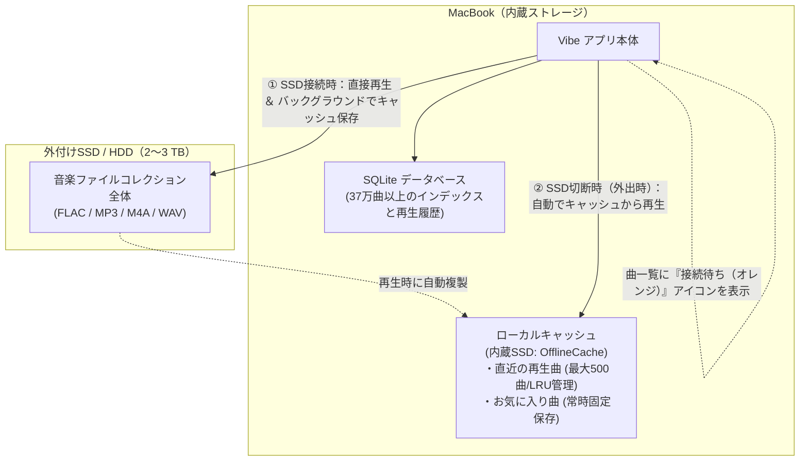
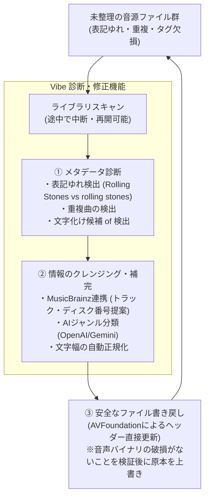

# Vibe

## 概要

**Vibe** は、大容量の外付けSSDや複数ストレージにまたがるローカル音楽コレクションを管理するために設計された、macOS向けの音楽プレイヤーです。Apple Music のストリーミング中心の設計に飽き足らず、自分でライブラリを構築・管理し続けてきた人のための、現代的なパーソナルライブラリマネージャーです。

## 開発の背景と解決したい課題

Vibe は、既存の市販ミュージックプレイヤーでは解決できない、以下の**2つの大きな課題**を解決するために開発されました。

### 1. 「2〜3TBの大容量ライブラリ」と「ノートPCの持ち出し」の両立

Apple Musicなどの既存プレイヤーは、曲数が増えると動作が極端に重くなる（10,000曲、さらにはVibeが想定する37万曲以上の規模では事実上フリーズする）だけでなく、外付けストレージの切断に対して脆弱です。外付けSSDを取り外してノートPCを持ち出すと、ライブラリのリンクが壊れたり、外出先で一切音楽が聴けなくなります。

Vibe は、インデックス（メタデータ）を内蔵SSDのSQLiteデータベースで超高速に管理しつつ、音源ファイル本体は外付けSSDに逃がします。さらに、**「ローカルキャッシュ機能」**により、SSDが未接続の外出先でもお気に入り曲や直近の再生曲（最大500曲）をシームレスにオフライン再生できます。



### 2. 「汚れたメタデータ」の一括クレンジング

長年収集した音楽コレクションは、タグの文字化け、表記ゆれ（例: `"The Rolling Stones"` と `"the Rolling stones"`）、トラック番号やディスク番号の欠損、重複曲などで溢れがちです。これらを綺麗にするには、何種類もの専用クレンジングツールを使い分ける必要がありました。

Vibe はライブラリを取り込む（スキャンする）段階から、表記ゆれや文字化け候補、重複を自動で診断。MusicBrainzやAI（OpenAI/Gemini）を活用して情報を補完し、音声データを破損させずにメタデータヘッダーだけを安全にファイルへ書き戻す一連のパイプラインを内蔵しています。




---

## こんな人のためのアプリです

### ターゲットペルソナ：「コレクター型ライブラリオーナー」

> *「曲は買うか変換して持っている。SSD に何千枚ものアルバムが入っていて、Apple Music やストリーミングには頼っていない。メタデータが汚れているのが気になるが、直す手段が分散していて一元管理できていない。」*

- MP3・FLAC・M4A・WAV などのローカルファイルで音楽を所有・管理している人
- 外付けSSD・外付けHDD・NASなど複数のストレージを使い分けている人
- iTunes / Apple Music の「ライブラリ外」に大量のファイルがあり、既存アプリでは管理しきれていない人
- メタデータの文字化け・タイポ・重複など「汚れたライブラリ」を気にしているが、専用ツールを使うほどではないと感じている人
- 音楽をジャンル・アルバムアーティスト・フォルダ構造で整理することを重視する人

---

## 他のアプリでできないこと

### 1. 外付けストレージを「一級市民」として扱う

Apple Music は内部ライブラリへのコピーを前提としており、外付けドライブが切断されるとライブラリが壊れたり曲が行方不明になります。Vibe は、外付けSSDが**接続中かどうかにかかわらず**ライブラリの構造を保持し、接続状態をリアルタイムで可視化します。

- ストレージが切断されている曲は一覧でわかる（接続待ちアイコン表示）
- 再接続後はスキャンなしで即時に復帰
- 複数のドライブをまたがるライブラリを単一のビューで統合管理

### 2. メタデータ診断と一括修正を内蔵

MusicBrainz Picard・Tune Sweeper・Gemini など複数のツールを使い分けていた作業を一つのアプリで完結させます。

- **重複曲の検出と一括削除**：チェックボックスで複数選択、まとめて削除
- **文字化け・タイポの検出**：全ライブラリのアーティスト名・アルバム名を解析し、表記ゆれ候補（例: "The Rolling Stones" vs "the Rolling stones"）を提示
- **欠損メタデータの発見**：タイトルなし・アーティストなし・アルバムなしの曲を一覧表示
- **MusicBrainz連携**：ネット経由でメタデータ候補を検索し、既存タグとのマッチスコアで並べ替えて提示
- **AI ジャンル分類**：OpenAI / Gemini API と連携し、ジャンルが未設定の曲を自動分類

### 3. ライブラリの変化を完全にログする

「いつ何が変わったか」がわかるアプリは少ない。Vibe はライブラリの追加・変更・削除をすべてタイムスタンプ付きで記録します。

- 曲の追加・削除・メタデータ変更の全履歴を閲覧可能
- SSD への転送（キャッシュからメインストレージへの移動）ログ
- スキャンセッション単位での進捗・エラー記録

### 4. スキャンの一時停止・再開・中断に対応

大容量ライブラリのスキャン中に作業が中断されても、途中から再開できます。他のプレイヤーでは「やり直し」が必要な状況でも、Vibe はカーソル位置を保存してスキャンを継続します。

---

## 主な機能

| 機能 | 説明 |
|---|---|
| 🔍 ライブラリスキャン | MP3 / FLAC / M4A / WAV に対応。スキャンの一時停止・再開・中断が可能 |
| 📊 メタデータ診断 | 重複・欠損・文字化け・表記ゆれを一画面で確認・修正 |
| 💿 ストレージ管理 | 外付けSSD の接続状態をリアルタイム追跡。SSD↔Mac間の転送をサポート |
| 📝 メタデータ編集 | タイトル・アーティスト・アルバム・ジャンル・アートワークを直接編集（ファイルへ書き込み） |
| 🤖 AI ジャンル分類 | OpenAI / Gemini API でジャンルを自動提案 |
| 🎼 MusicBrainz 検索 | 既存メタデータからリリース候補を照合し、トラック・ディスク番号を提案 |
| ⭐️ お気に入り | 曲単位のお気に入り登録と絞り込み |
| 📋 プレイリスト | 手動プレイリストの作成・管理 |
| 🗂 フォルダブラウズ | ファイルシステムのフォルダ構造でライブラリを閲覧 |
| 📜 アクティビティログ | ライブラリの追加・変更・削除の全履歴を保持 |
| 🌙 ダーク／ライトモード | システム設定に追従 |

---

## 競合との比較

| | Apple Music | Swinsian | **Vibe** |
|---|---|---|---|
| ローカルファイル管理 | △（コピー前提） | ✅ | ✅ |
| 外付けSSD 対応 | △ | ✅ | ✅（接続状態の可視化あり） |
| メタデータ診断 | ✖ | △（タグ編集のみ） | ✅（診断・変異検出・一括修正） |
| ライブラリログ | ✖ | ✖ | ✅ |
| AI ジャンル分類 | ✖ | ✖ | ✅ |
| スキャン再開 | ✖ | ✖ | ✅ |
| ストリーミング | ✅ | ✖ | ✖（ローカル特化） |

---

## こんなライブラリにフィットします

- 外付けSSD に保存した **数千〜数万曲** のローカルコレクション
- rip したCDや購入ダウンロードで構成された **MP3 / FLAC 混在ライブラリ**
- 長年かけて育てたため **メタデータが不揃い** になっているコレクション
- Apple Music に取り込まずに **自分のフォルダ構造で管理** したい

---

## 開発ノート

`MassiveMusic` から表示名を `Vibe` へ変更しました。既存の370,270曲のライブラリをそのまま引き継ぐため、バンドルIDとApplication Support内の保存ディレクトリ名は互換性のため変更していません。

## v0.14 の追加機能と修正

- 曲情報の編集画面に「前へ」「次へ」と現在位置を追加しました。編集画面を開いた時点の検索・ソート済みページ順で移動し、現在の音源ファイルへの保存と検証が成功した場合だけ次の曲を表示します。保存に失敗した場合は入力内容を維持したまま同じ曲に留まります。⌘[／⌘]でも移動できます。

- 設定の「表示」に「文字幅を自動で正規化」を追加しました。初期状態は安全のためOFFです。有効時は、タイトル、アーティスト、アルバム、アルバムアーティスト、ジャンルの半角カナを全角カナへ、全角英数字・ASCII記号を半角へ変換し、検証付きの曲情報更新経路で音源ファイルへ保存します。通常のひらがな、アクセント付き文字、ローマ数字、丸数字、文字間の空白は変更しません。
- 文字幅の処理はID順に200曲ずつ行い、変更がある曲だけを書き込みます。進捗位置をSQLiteへ保存するため、停止、アプリ終了、SSD切断後も続きから再開でき、36万曲を一度にメモリへ読み込みません。設定を無効にすると処理をキャンセルします。
- ライブラリ欄の曲、最近追加した曲、次に再生、アルバム、アーティスト、ジャンル、フォルダ、お気に入り、キャッシュをドラッグして上下に並べ替えられます。順序は保存され、外部保存先のときだけ表示されるキャッシュの位置も維持します。
- メタデータ診断へ「文字化け候補」を追加しました。タイトル、アーティスト、アルバム、アルバムアーティスト、ジャンル、ファイル名に代表的な誤デコード文字列がある曲をページング表示します。「URLを含むMP3」の件数は表示ページと同じSQL条件から再集計します。
- MusicBrainz検索は曲名・アーティスト・アルバム名を自動変更せず、候補としてだけ表示します。設定を有効にした場合も、3つの名前とローカルのアルバム曲数が一致したときだけ、ディスク番号とトラック番号を編集欄へ提案します。
- 一部のM4Aで直接のヘッダー更新が拒否される場合は、AVFoundationのパススルー書き出しへ自動的に切り替えます。作業コピーの読戻しと音声内容を検証してから原本へ反映し、音声の再エンコードは行いません。

## v0.13 の修正

- M4Aの曲情報は、読み取り専用だったAudioToolbox情報辞書ではなくAVFoundationでヘッダーだけを書き換えます。作業コピーで読戻し検証し、`mdat` 音声領域がバイト単位で不変であることを確認してから元ファイルへ反映します。音声の再エンコードは行いません。
- ミニプレイヤーは390×180に固定し、ウインドウ境界・ズームボタンから大きさを変更できないようにしました。通常画面へ戻すとリサイズを再び有効にします。
- 曲の右クリックメニューでは、登録済みプレイリストを入れ子のサブメニューではなく「プレイリストに追加」セクションへ直接表示します。アプリ起動直後の最初の右クリックでも候補が表示されます。
- 再スキャン時に画面が古いスキャンルートIDを保持していても、選択フォルダのパスとブックマークから現行DBのルートへ解決し直してからセッションを作成します。存在しないroot IDによるSQLite外部キーエラーで再スキャンが停止しません。

## v0.12 の追加機能

- メイン保管先が外部SSD/HDDの場合だけ、ライブラリ欄に「キャッシュ」を表示します。Mac内の `Application Support/MassiveMusic/OfflineCache` に実在する曲だけを通常の曲一覧と同じく200曲ずつ表示し、検索、ソート、ダブルクリック再生ができます。SSDが外れていてもキャッシュ済み曲を再生できます。メイン保管先がローカルの場合は、その保管先自体がキャッシュを兼ねるため、別の「キャッシュ」項目は表示しません。
- キャッシュ画面上部で「再生時に保存」の有効／無効と、直近に保持する曲数（0〜500曲）を変更できます。上限を小さくすると、固定保存したお気に入りを除き、古いキャッシュから整理します。
- キャッシュされていない曲は右クリックメニューに「ローカルにキャッシュ」を表示します。SSD上の元ファイルは移動・変更せず、Mac側へ複製します。キャッシュ済み曲は「ローカルキャッシュから削除」でローカル複製だけを削除できます。
- キャッシュ一覧と状態判定はSQLiteでページングし、ライブラリ全件や全キャッシュ曲をSwift配列へ読み込みません。

## v0.11 の追加機能

- 曲の右クリックメニューから「この曲の情報を編集…」を開き、「MusicBrainzから候補を検索」を押すと、曲名・アーティスト・再生時間・現在のアルバムを照合して候補を表示します。タイトル、アーティスト、アルバム名は自動変更しません。設定を有効にし、名前とアルバム曲数が一致した場合だけ、ディスク番号とトラック番号を編集欄へ提案します。
- 再発盤やベスト盤など複数の候補がある場合は「他の候補」から選び直し、MusicBrainzのリリースページで確認できます。候補を入力しただけではファイルを変更せず、最後に「ファイルへ保存」を押したときだけ既存の検証・復元付き書き込みを実行します。
- MusicBrainzの利用制限を守るため、Web検索は1.1秒以上の間隔を空けます。現在のアルバムを含む検索で見つからない場合は、アルバム条件を外して自動的に再検索します。

## v0.10 の修正

- 検索語が入っているときは、検索欄右端の×ボタンを1回押すだけで内容を消去し、全件表示へ直ちに戻せます。
- 入力待機中とデータベース検索中は、検索欄内に進捗表示と「検索中…」を表示し、枠線もアクセント色へ変わります。

## v0.9 の追加機能

- 再生を開始した曲は、設定の「再生した曲をローカルにキャッシュ」が有効な場合、Mac内のアプリライブラリ `Application Support/MassiveMusic/OfflineCache` にコピーして以後の再生に使います。既定では直近24曲、設定可能範囲は0〜500曲です。
- 星をクリックして新しくお気に入りへ追加すると、「追加してローカルに保存」「お気に入りだけに追加」「キャンセル」を確認します。ローカル保存は音源をSSDから移動せず、Mac内へ複製します。
- お気に入りから明示的にローカル保存した曲は固定キャッシュとして扱い、直近曲数の上限を超えても削除しません。お気に入り解除時は固定を外し、通常のLRU管理へ戻します。
- 再生時はSSDより先にローカルキャッシュを確認するため、保存済みの曲はSSDが未接続でも再生できます。
- 設定の「オフライン」にキャッシュの絶対パスと「Finderでキャッシュを表示」を追加しました。

## v0.9 の修正

- サイドバーの「ログ」には、ライブラリへの曲追加、ローカルキャッシュへの追加、メイン保管先への追加も記録します。ログは新しい順に最大1,000件を保持し、100件ずつ最大10ページで表示します。
- FLACからMP3への取り込みは1曲ずつ変換・登録・保存を完結させます。1曲が失敗しても残りを続行し、失敗したファイル名と原因を最後にまとめて表示します。
- ffmpegの進捗取得を非ブロッキングの進捗ファイル監視へ変更しました。成功、失敗、キャンセルのどの終了経路でも取り込み進捗表示を必ず解除し、`13/14`などの古い表示が残りません。
- 後日「確認して移動」した曲や、外部メイン保管先の再接続後に自動移動した曲も、実際の移動先パス付きでログへ記録します。

## v0.8 の修正

- 曲へ登録した埋め込みアルバムジャケット（MP3のID3 APIC）を右ペインで優先表示します。埋め込み画像がない場合だけ、従来のMusicBrainz/Cover Art Archive画像へフォールバックします。
- ジャケット編集後は該当曲のメモリ／ディスク画像キャッシュを破棄し、再生中の曲であれば右ペインを直ちに再読込します。
- 古いオフライン音源キャッシュにジャケットが入っていない場合はそこで終了せず、接続中の登録元ファイルから画像を取得します。

## v0.7 の追加機能

- 右ペインのAIジャンル候補には、キーの登録状態にかかわらず「AI設定を開く（OpenAI・Gemini）」を常時表示します。
- AI設定でOpenAIとGeminiのAPIキーを個別に登録・変更・削除できます。キーは一般設定ファイルやUserDefaultsへ書かず、アプリ専用の保護データベースへ保存します。旧版のKeychain項目がある場合だけ、認証UIを出さない移行処理で保護データベースへ移します。
- OpenAIとGeminiの接続状態を「未登録・確認中・有効・エラー」で表示します。起動時、保存時、「接続を再確認」時に、曲情報を送信しない認証確認を行います。
- ジャンル判定はOpenAIを優先し、失敗時はGemini、両方が失敗または未登録の場合はオフラインの内蔵AIへ自動的に切り替えます。切替理由と使用したプロバイダーを結果に表示します。
- OpenAIとGeminiのモデル名はそれぞれ変更できます。既定値はOpenAI `gpt-5.6-luna`、Gemini `gemini-3.5-flash`です。

## v0.6 の追加機能

- 曲一覧は通常クリックで選択開始、Commandクリックで個別追加／解除、Shiftクリックで最初に選んだ曲からクリックした曲までを連続選択できます。Command+Shiftでは既存選択へ範囲追加します。曲一覧を一度クリックした後のCommand+Aは、表示中の1ページ（最大200曲）をすべて選択します。検索欄に入力中のCommand+Aは検索文字の全選択のままです。
- 固定再生バーは曲一覧へ重ねず、ウインドウ下部に専用の高さを確保します。ページ末尾の曲も再生バーに隠れず、スクロールして選択できます。
- 「選択」メニューから表示中のページ（最大200曲）を一括選択できます。選択した曲は、タイトル、アーティスト、アルバム、アルバムアーティスト、ジャンル、ディスク番号、トラック番号をまとめて変更できます。トラック番号は開始番号から一覧順に連番を付けるか、同じ番号を設定できます。
- 一括編集には共通のアルバムジャケットを登録できます。JPEG/PNGのファイル選択に加えて、クリップボード内の画像をCommand+Vまたは「クリップボードから貼り付け」で取り込めます。画像は最大1600pxのJPEGへ正規化し、プレビューしてから適用します。
- メタデータ診断は重複曲をグループ集計で検出し、画面移動で不要になった診断集計と一覧取得を無効化します。診断項目を巡回して曲一覧へ戻った後も、古い処理による読み込み表示が残り続けません。
- 大量編集は曲ごとに作業コピーへ書き込み・読戻し検証してから原本へ反映し、進捗、失敗件数、キャンセルを表示します。一曲の失敗で残りすべてを中断しません。
- ジャケットのファイル書き込みは現在MP3（ID3 APIC）のみです。M4A/WAVが混ざる選択では実行前に明示して無効化し、意図しない部分更新を防ぎます。文字項目は従来どおり各対応形式で編集できます。

## v0.5 の追加機能

- アーティストタグが空の曲は、タグやファイルを変更せず、アーティスト一覧の「不明なアーティスト」に論理的にまとめます。項目を開くと該当曲をページング表示します。
- サイドバーの「メタデータ診断」で、曲名なし、不明なアーティスト、アルバム名なし、URLを含むMP3、重複曲を個別に確認できます。重複曲はチェックボックスで複数選択し、確認画面から「ライブラリからのみ削除」または「実ファイルをゴミ箱へ移動」を選べます。
- 全角・半角、空白、大文字小文字の差と、軽いタイプミスの可能性を、キャンセル可能なバックグラウンド解析で候補化します。候補は自動修正せず、確認用にだけ表示します。
- ミニプレイヤーは別ウインドウを増やさず、同じウインドウを通常表示とミニ表示で切り替えます。ミニ表示にはアプリアイコンと通常表示へ戻すボタンがあります。
- 曲一覧を固定サイズのページ内 `LazyVStack` に変更し、列見出しと曲の間に生じていた大きな上下余白を解消しました。
- タイトル・アーティスト・アルバム・時間の列境界をドラッグして幅を変更できます。ツールバーの「表示項目」からタイトル・アーティスト・アルバム・時間・形式を個別に表示／非表示にでき、幅と表示状態は次回起動後も維持されます。
- 列を広げて画面幅を超えた場合は、列見出しと曲行が同期する横スクロールで隠れた列を表示できます。
- 曲一覧と右側の再生情報・歌詞パネルの境界も左右へドラッグして幅を変更でき、設定した幅は次回起動後も維持されます。
- 狭いウインドウではアルバム／アーティスト情報と検索操作を2段に切り替え、長い名前が一文字ずつ縦に折り返されないようにしています。
- ページ分母は各ビューの正確なDB総数です。現在ページの前後5ページと、その外側に「-1000」「-100」「-10」「+10」「+100」「+1000」を固定順で表示します。移動先が範囲外になる相対リンクは表示せず、ページリンク自体は一定数だけを生成します。

## v0.4 の追加機能

- 曲を右クリックして「曲情報を編集…」を選ぶと、タイトル、アーティスト、アルバム、アルバムアーティスト、ジャンル、ディスク番号、トラック番号を編集できます。
- MP3はID3v2.3/2.4の対象テキストフレームを編集し、ID3v2.2以前は確認後にv2.3へ変換します。M4AはAVFoundationで `moov` ヘッダーだけを置換し、WAVはRIFF `LIST/INFO`を使います。アプリ内の一時コピーへ書き込み、読戻し検証と音声バイトの保持を確認できた場合だけ原本へ反映します。読み取れるジャケット等を保持し、音声は再エンコードしません。
- 古いMP3のID3サイズが壊れている場合は、連続する3個の有効なMPEG Layer IIIフレームを確認できたときだけ音声開始位置を回復します。確認できないファイルは変更せずエラーとして記録し、自動処理は後続の曲へ進みます。
- ID3v2.2の個別フレーム表が破損している場合、明示的な修復経路では読めない古いタグ表だけを破棄し、ライブラリの主要項目からID3v2.3タグを再構築します。読み取れるv2.2のジャケット等は引き続き保持し、どちらの場合も検証済みのMP3音声部分は変更しません。
- ID3v2.4からv2.3へ書き換える際は、保持するフレームのサイズ表現も安全に変換します。実際に壊れたMP3タグを検出した場合は「タグを修復して保存」を提示し、音声開始位置を検証した作業コピー上でタグだけを再構築します。読み取れない追加タグや埋め込み画像が失われる可能性は確認画面に明示します。
- 「削除…」では「ライブラリからのみ削除」と「実ファイルをゴミ箱へ移動」を別ボタンで確認します。永久削除は行いません。
- ライブラリだけから外した曲は除外記録を保持し、再スキャンで意図せず復活しません。
- 以前の読み取り専用ブックマークで登録したフォルダは、最初の編集またはゴミ箱移動時だけフォルダの再選択を求め、読み書き権限を安全に更新します。
- コピー処理の内側に含まれるCocoa/POSIX権限エラーも検出し、読み取り専用の旧ブックマークだった場合は音楽ルートの再選択後に一度だけ安全に再試行します。

## v0.3 の追加機能

- 曲一覧の「タイトル」「アーティスト」「アルバム」「時間」「形式」をクリックすると、データベース上で昇順・降順を切り替えます。メモリ上で全曲を並べ替えることはありません。
- 設定の「表示」から日本語・English、システム・ライト・ダーク外観をアプリ内で切り替えて保存できます。
- WikipediaとGoogle Newsは選択言語の地域・言語版を取得します。内蔵ブラウザから開く外部記事は、選択言語のGoogle Translate表示へ導きます。
- アルバム一覧はアーティストと曲数、アーティスト一覧はアルバム数と曲数を表示します。名前をクリックすると、ページングされた詳細ページに移動します。
- 曲・アルバム・アーティストの見出しには件数、対象曲の合計容量（GB）、曲ファイルを含む登録ルートの絶対パスを表示します。容量とパスはSQLiteで集計し、曲の全件読み込みは行いません。
- アーティスト検索は先頭の `The ` を入力しなくても一致します。一覧の並び順と右端の索引も `The ` を無視しますが、表示名は変更しません。

## v0.2 の追加機能

- 「曲を取り込む」は、選択した音源をまずApplication Supportの `Inbox` にコピーします。設定画面で保存先を選び、各曲の「確認して移動」を押した場合だけ保存先へ移動します。
- 保存先はsecurity-scoped bookmarkで保持し、SSDからローカルフォルダへ変更できます。未接続時はサイドバーに警告を表示し、移動ボタンを無効化します。
- 曲一覧の星を押すと、曲情報を複製せず `お気に入り` 動的ビューへ表示します。
- 再生した曲は既定で直近24曲までApplication Supportの `OfflineCache` にコピーし、次回はローカルキャッシュを利用します。設定で無効化または0〜500曲へ変更できます。
- 再生中の曲は右側のインスペクタに歌詞、ライブラリ内の類似曲、Wikipedia、ニュース検索を表示します。歌詞はLRCLIB、アルバム情報はMusicBrainz/Cover Art Archive、WikiはMediaWiki APIを必要時だけ照会します。
- Web画像と歌詞はローカルへキャッシュします。ライブラリ全件への一括Web照会は行いません。
- ツールバーから同じウインドウをミニプレイヤー表示へ切り替えられます。
- 設定画面の「実装状況」で完了・一部完了・未着手を確認できます。

### v0.2 の保存場所

- DB: `~/Library/Containers/com.local.MassiveMusic/Data/Library/Application Support/MassiveMusic/MassiveMusic.sqlite`
- 新規曲の一時受信箱: `.../Application Support/MassiveMusic/Inbox`
- オフライン再生: `.../Application Support/MassiveMusic/OfflineCache`
- Web画像: sandbox内の `Library/Caches/MassiveMusic/WebArtwork`

音源を保存先へ移動する操作以外は、元のSSD上のファイルを変更・削除しません。移動はUI上の明示確認後にだけ実行されます。

### v0.2 の既知の制限

- SSDとの差分表示は現在「DBに登録済みだが最新スキャンで見つからない曲」の件数までです。SSD上にだけある未登録ファイルの専用差分一覧は未実装です。
- オフラインキャッシュは曲数上限のみです。アルバム枚数単位の上限は未実装です。
- 類似曲はローカルのジャンル・アーティスト・アルバムアーティストから算出します。音響特徴量によるジャンル推定は未実装です。
- アーティストニュースは保存や自動通知を行わず、アプリ内ブラウザでGoogle News検索を開きます。
- ジャンル行を開くと、そのジャンルのアルバム・アーティスト・曲を200件ずつ切り替えて閲覧できます。
- Wikipediaとニュースは右ペイン内に表示され、「情報へ戻る」で再生情報へ戻ります。
- AIジャンル候補は、OpenAI APIキーが未登録でもネットワークを使わない内蔵メタデータ分類器で利用できます。外部AIのキーはアプリ専用の保護データベースに保存され、曲名・アーティスト・アルバム等のメタデータだけを送信します。音声解析ではありません。自動登録トグルを有効にした場合も、未分類かつ確信度80%以上の曲だけを登録します。右ペインの設定リンクはAIタブとAPIキー入力欄を直接開きます。
- 曲の右クリックまたは類似曲の追加ボタンから「次に再生」へ追加できます。キューはSQLiteへtrack IDと順序だけを保存し、右ペインで100件ずつ表示します。
- 類似曲の曲名をクリックするとその曲の再生へ切り替わり、右ペインは歌詞表示へ戻ります。情報タブのYouTubeボタンは検索結果と動画を右ペイン内に表示します。
- 曲・アルバム・アーティスト一覧の右端には、A–Z、五十音、0–9の縦スクロール索引があります。文字を押すとSQLiteで位置を求め、その位置から200件だけを読み込みます。
- 一覧と再生情報の境界には常時表示のグリップがあります。18pxの範囲をドラッグして幅を変更でき、ダブルクリックで標準幅へ戻せます。
- Web提供元に一致データがない曲、ネット接続がない場合、画像・歌詞・Wikiは表示されません。

Vibe is a native Apple Silicon macOS application for searching, organizing, and playing very large local music libraries stored on external drives. The internal `MassiveMusic` identifiers remain in place so existing local databases, bookmarks, caches, and settings continue to work.

## Requirements

- Apple Silicon Mac
- macOS 26 or later
- Xcode 26 or later
- [XcodeGen](https://github.com/yonaskolb/XcodeGen) to regenerate the checked-in Xcode project

GRDB 7.10.0 is resolved by Swift Package Manager. No global package installation or `sudo` is required by the project.

## Build and test

```sh
xcodegen generate
xcodebuild -project MassiveMusic.xcodeproj \
  -scheme MassiveMusic \
  -configuration Debug \
  -destination 'platform=macOS,arch=arm64' \
  CODE_SIGNING_ALLOWED=NO build

xcodebuild -project MassiveMusic.xcodeproj \
  -scheme MassiveMusic \
  -configuration Debug \
  -destination 'platform=macOS,arch=arm64' \
  CODE_SIGNING_ALLOWED=NO test
```

Open `MassiveMusic.xcodeproj` in Xcode for a signed local run. Select your development team if Xcode requests one.

## Use

1. Launch Vibe.
2. Choose **File → 音楽フォルダを追加…** (`Shift-Command-O`) or use the folder toolbar button.
3. Select a folder containing MP3, M4A, or WAV files.
4. The scan runs outside the main actor and commits every 750 files. Use the status bar to pause, resume, or cancel it.
5. Double-click a row to play it. Click a column header once for ascending order and again for descending order. Search is debounced and cancellable; the table displays only one 200-row keyset page at a time.

The sidebar provides tracks, albums, artists, genres, folders, and playlists. Playlist imports and exports accept M3U/M3U8. The **All Tracks** view is dynamic and never creates a fixed 360,000-item playlist or queue.

The **Metadata Diagnostics** section pages deterministic issue lists directly from SQLite. Duplicate rows provide checkbox multi-selection, page-scoped Select All/Clear controls, and a required confirmation that separates library-only removal from moving source files to Trash. Variation analysis persists distinct terms and bounded candidate buckets in SQLite instead of loading all tracks into memory. Typo candidates are heuristic review hints and are never applied automatically.

Clicking either value in a metadata-variation candidate opens the Songs view with an exact field-and-value filter. For example, clicking an Album value returns only tracks whose album tag exactly matches that value; a same-named song title or an album with different capitalization is not included.

MP3 metadata editing supports the standard TCMP compilation flag. Enabling it does not overwrite each track's Artist tag; use Album Artist (commonly `Various Artists`) independently when appropriate. Damaged legacy ID3v2.2 frame tables can be explicitly rebuilt after Vibe validates the MPEG audio boundary, while the audio payload remains byte-identical.

The **Log** section under **Manage** records file additions, scan-detected changes, metadata edits, unavailable/restored files, library-only removals, and files moved to Trash. Log rows retain path and metadata snapshots, support type filters and text search, and are fetched in 200-row pages. The newest 100,000 entries are retained; installing schema v7 does not fabricate history for earlier activity.

The **Up Next** queue is persisted in SQLite as track IDs and order only. Its inspector page fetches 100 rows at a time; Next consumes one queued row before falling back to adjacent or bounded-shuffle playback.

## Storage

The database is stored at:

```text
~/Library/Application Support/MassiveMusic/MassiveMusic.sqlite
```

For a sandboxed build, macOS may map this path into the application container. Artwork thumbnails are stored under the user Caches directory in `MassiveMusic/Artwork`. No database, cache, or settings are written into the selected music folder.

The database uses WAL mode, foreign keys, versioned migrations, FTS5 synchronization triggers, and short transactions. Security-scoped bookmarks retain read/write access to user-selected roots; file mutations still require an explicit in-app action.

## Architecture and scale safeguards

- Track tables and playlists are fetched in bounded pages.
- Track browsing uses keyset cursors, avoiding deep `OFFSET` queries during normal scrolling.
- FTS5 queries run on the database reader pool after a 280 ms UI debounce.
- Scanning, metadata parsing, playlist bulk operations, and database reads do not run on the main actor.
- Scanner state and its resume cursor are persisted after each 750-file commit.
- Deleted or disconnected tracks are marked unavailable, not immediately deleted.
- Visible tracks whose source drive is disconnected, or whose individual source file is missing, show an orange external-drive warning before playback. File existence checks are bounded to the current 200-row page. A valid local cache remains playable and suppresses that warning; missing-file playback errors provide localized reconnect/rescan guidance instead of the generic macOS open error.
- Shuffle selects bounded deterministic candidate buckets and never runs `ORDER BY RANDOM()` over the full library.
- Artwork is decoded only on demand, with 64 MB memory and 2 GB disk cache limits.

## Performance and verification

See [PERFORMANCE.md](PERFORMANCE.md) for commands and measurements from the 360,000-row synthetic benchmark and real WAV playback smoke test.

## Known limitations

- The target drive `/Volumes/Transcend/Music/Music` was fully scanned on 2026-07-16: 370,270 tracks were registered with no scan errors. See `PERFORMANCE.md` for the filesystem/DB reconciliation and measurements.
- Playlist rows can be moved one position at a time from the row context menu; drag-and-drop reordering is deferred.
- Folder views are paged textual facets. Genre rows drill down to separately paged albums, artists, and songs; dedicated artwork grids are deferred.
- Media key and Now Playing handlers are implemented but depend on the active macOS media-session policy and were not exhaustively tested with every keyboard model.
- A CoreSimulator version warning may appear in `xcodebuild` output on this Mac. macOS builds and tests still run successfully; no simulator is used.
- The direct WAV tag writer currently supports standard RIFF/WAVE files up to 4 GB. RF64 metadata editing is rejected without changing the original.

## Safety

Normal scanning, searching, browsing, and playback open source audio read-only. Source files are changed only after the user explicitly chooses **Save to File** or **Move Source File to Trash**; metadata writes use a verified temporary copy and deletion uses the recoverable macOS Trash.

If an older scan bookmark only grants read access, the first edit asks the user to choose the original music root again. Vibe retains that live security scope until the temporary copy is verified and the source replacement finishes, then stores the renewed bookmark for later edits.
