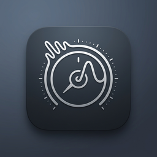
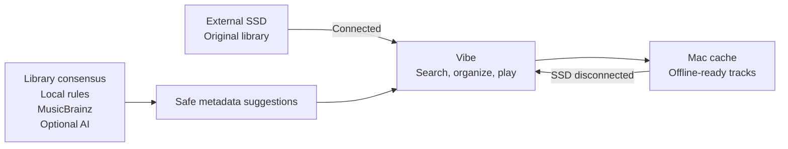
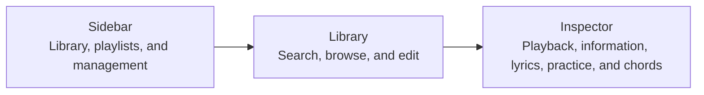

# Vibe

<p align="center">
  
</p>

<p align="center">
  English | <a href="README.ja.md">日本語</a>
</p>

Vibe is a macOS music player built for large, carefully maintained local collections. Keep the original library on an external SSD, continue listening from a protected Mac-side cache when the drive is away, and let opt-in metadata automation handle repetitive cleanup without uploading your audio to a streaming service.

> The current release supports Apple Silicon. Distributed builds are ad hoc signed and are not notarized by Apple.

## Keep the collection yours

### External storage can remain the source of truth

Choose an external SSD as the primary home for your music instead of duplicating the whole collection onto your Mac. Vibe remembers the library when the drive is disconnected, shows its connection state clearly, and returns to the original files when the drive reconnects.

### Take the music you care about offline

Vibe automatically keeps playable local copies within a configurable cache limit. Favorites and playlist tracks are protected from routine cache cleanup, so the music you intentionally organized remains available even when the main storage is not connected.

### Automate metadata work without giving up control

Enable only the maintenance jobs you want. Vibe can standardize genre names, suggest track and disc numbers through MusicBrainz, look up missing release years, normalize safe text differences, and classify untagged genres through library consensus, local rules, MusicBrainz, then an optional external AI provider. Existing genres are not overwritten by automatic classification, audio is not sent to AI providers, and file edits are validated through a working copy before the original is replaced.


```mermaid
flowchart LR
    SSD["External SSD\nOriginal library"] -->|Connected| Vibe["Vibe\nSearch, organize, play"]
    Vibe --> Cache["Mac cache\nOffline-ready tracks"]
    Cache -->|SSD disconnected| Vibe
    Sources["Library consensus\nLocal rules\nMusicBrainz\nOptional AI"] --> Metadata["Safe metadata suggestions"]
    Metadata --> Vibe
```

## Highlights

### Built for large libraries

- Search, sorting, and pagination powered by SQLite, GRDB, and FTS5
- Designed to handle libraries of around 370,000 tracks without loading every track into memory
- Scan and play MP3, M4A, WAV, and FLAC files
- Browse by track, album, artist, genre, folder, favorites, or recently added
- Show optional release-year columns for tracks and albums, and a representative genre for each artist
- Save column order, visibility, and width
- Restore your scroll position when returning to the artist list
- Keep keyboard focus during incremental search, with a full-size search field from the first keystroke
- Start with a concise library sidebar while preserving every saved visibility and ordering choice

### External SSD workflow and offline playback

- See the connection status of your primary storage location in the sidebar
- Keep library metadata available when your SSD is disconnected
- Cache played tracks on your Mac automatically, using the original file when connected and the cached copy when offline
- Protect favorites and playlist tracks from LRU cache cleanup
- Store imports temporarily on your Mac while the SSD is disconnected, then move them when it reconnects
- Manage cache, storage differences, locations, and import status from one screen

### Playback and guitar practice

- Keep playback controls available at the top of the inspector
- Jump to the current album from its artwork or title, or to the artist page from the artist name
- Use shuffle, repeat-one, and album or playlist repeat; shuffle the connected library or the playable cache when storage is offline
- Choose playback speeds from 60% to 95% in 5% steps, or play at 100%
- Shift pitch down a semitone, play at the original pitch, or shift up a semitone without changing speed
- Save up to three A–B repeat loops per track
- Restore practice settings and loops after relaunching the app
- Read embedded BPM or estimate it locally for the Practice tab, then retain the result per track
- Search YouTube for guitar or bass TAB videos using the current track and artist
- Open Chordify in the Chords tab and navigate back with the built-in browser
- Switch to a fixed-size mini player with the same control language as the inspector player

### Track information and discovery

- View track details, lyrics, discovery links, practice tools, and chords in the inspector
- Browse trending music, YouTube, and music news when nothing is playing
- Open YouTube and external articles in the built-in browser; media stops when you return to track information
- Turn automatic article translation on or off from Display settings or by clicking its status in the built-in browser; the current page updates immediately
- Prefer embedded artwork and fall back to external artwork when needed
- Cache, add, and edit lyrics; auto-scroll synchronized lyrics during playback

### Playlists and library controls

- Create, delete, reorder, and rename playlists
- Import and export M3U and M3U8 playlists
- Select multiple tracks with Shift-click or Command-click
- Add several tracks to favorites or playlists at once
- Keep empty playlist states stable without visual flicker
- Show, hide, and reorder library sections

### Automatic metadata care and safer editing

- Edit title, artist, album, album artist, genre, and track or disc numbers for MP3, M4A, and WAV files
- Batch-edit artist, album, album artist, genre, and disc number
- Turn each metadata automation on to run it continuously, or turn it off to stop it; no separate start/stop controls are required
- Standardize Japanese and inconsistent genre spellings to canonical English names, merging differences in case, punctuation, middle dots, and hyphens
- Look up missing album release years through MusicBrainz and configured Web/AI sources
- Write to a working copy, read it back, and validate the audio before replacing the original
- Restore the original after a failed edit and move deleted files to the Trash
- Confirm and safely convert older ID3v2.2 tags to ID3v2.3 before completing an edit
- Run ID3 migration, character-width normalization, and MusicBrainz number suggestions in the background
- Diagnose duplicates, missing values, mojibake, and inconsistent naming

### AI-assisted genre suggestions

- Resolve untagged genres through trusted library consensus, high-confidence local rules, MusicBrainz, and finally a configured external AI provider
- Automatically register only results with at least 80% confidence and never upload audio for classification
- Keep existing genres unchanged during automatic classification
- Show the active source, live per-genre counts, registered/below-threshold/failed totals, and a retry countdown for temporary provider failures
- Cache MusicBrainz lookups during a scan and treat missing external metadata as a normal result instead of an error
- Explain common genre characteristics in the genre list and detail screen
- Store API keys in Vibe's protected in-app database instead of adding them to Keychain
- Restore only the key registration status at launch without reading the key itself

### Appearance and workspace

- Choose from three dark and three light themes with live previews
- Keep native controls, text, tables, and sidebars readable in every theme
- Restore the previous normal-window size and screen position on the next launch
- Show cache track count and storage size, plus named background-task progress, at a glance

## Layout


```mermaid
flowchart LR
    Sidebar["Sidebar\nLibrary, playlists, and management"]
    Library["Library\nSearch, browse, and edit"]
    Inspector["Inspector\nPlayback, information, lyrics, practice, and chords"]
    Sidebar --> Library --> Inspector
```

Background analysis and ID3 migration progress appear at the bottom of the sidebar, leaving the full height of the center pane available for tracks. You can collapse the side panes and resize the inspector.

## Requirements

- Apple Silicon Mac
- macOS 26.0 or later
- Xcode 26 (when building from source)
- An internet connection only when using MusicBrainz, external articles, YouTube, Chordify, or an AI provider

## Install

### Homebrew

```bash
brew install --cask nanonigit/vibe/vibe
```

To upgrade an existing Homebrew installation:

```bash
brew update
brew upgrade --cask vibe
```

### Direct download

Download `Vibe-v0.16.0-macos-arm64.zip` from [GitHub Releases](https://github.com/nanonigit/Vibe/releases), extract it, and move `Vibe.app` wherever you prefer.

The current build is not notarized. If macOS blocks the first launch, Control-click Vibe in Finder, choose **Open**, review the warning, and confirm that you want to launch it.

## Build from source

Swift Package Manager downloads the GRDB dependency automatically.

```bash
git clone https://github.com/nanonigit/Vibe.git
cd Vibe
xcodebuild \
  -project MassiveMusic.xcodeproj \
  -scheme MassiveMusic \
  -configuration Release \
  -destination 'platform=macOS' \
  -derivedDataPath .build \
  build
open .build/Build/Products/Release/Vibe.app
```

## Test

```bash
xcodebuild \
  test \
  -project MassiveMusic.xcodeproj \
  -scheme MassiveMusic \
  -destination 'platform=macOS'
```

See [PERFORMANCE.md](PERFORMANCE.md) for large-library testing instructions.

## Data and safety

- Vibe stores its library database and offline cache under `Application Support/MassiveMusic`.
- To preserve compatibility for existing users, the bundle identifier and storage directory still use `MassiveMusic` even though the app is named Vibe.
- Access to music folders is limited to locations you select and is retained with security-scoped bookmarks.
- Metadata changes use a validated working copy, but you should still keep a separate backup of important audio files.
- Do not commit API keys, audio file paths, or library databases to this repository.

## Current limitations

- Vibe can scan and play FLAC files, but direct tag writing is limited to MP3, M4A, and WAV.
- Writing artwork to files and editing compilation tags are currently supported only for MP3.
- Chordify, YouTube, news, and other external content depend on each service's availability and terms.
- Distributed builds are not notarized by Apple.

## Technology

- Swift 6 / SwiftUI / AppKit
- AVFoundation / AVAudioEngine
- SQLite / GRDB / FTS5
- XCTest / Swift Testing

See [THIRD_PARTY_NOTICES.md](THIRD_PARTY_NOTICES.md) for third-party libraries and licenses.
