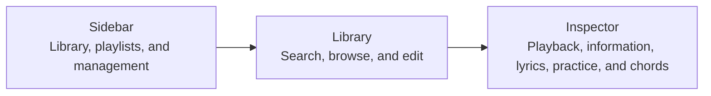

# Vibe

<p align="center">
  
</p>

<p align="center">
  English | <a href="README.ja.md">日本語</a>
</p>

Vibe is a macOS music player for managing large local music collections across your Mac and external storage. Search, play, and organize your MP3, M4A, WAV, and FLAC files without uploading your music to a streaming service.

> The current release supports Apple Silicon. Distributed builds are ad hoc signed and are not notarized by Apple.

## Highlights

### Built for large libraries

- Search, sorting, and pagination powered by SQLite, GRDB, and FTS5
- Designed to handle libraries of around 370,000 tracks without loading every track into memory
- Scan and play MP3, M4A, WAV, and FLAC files
- Browse by track, album, artist, genre, folder, favorites, or recently added
- Save column order, visibility, and width
- Restore your scroll position when returning to the artist list

### External SSDs and offline playback

- See the connection status of your primary storage location in the sidebar
- Keep library metadata available when your SSD is disconnected
- Cache played tracks on your Mac automatically, using the original file when connected and the cached copy when offline
- Protect favorites and playlist tracks from LRU cache cleanup
- Store imports temporarily on your Mac while the SSD is disconnected, then move them when it reconnects
- Manage cache, storage differences, locations, and import status from one screen

### Playback and guitar practice

- Keep playback controls available at the top of the inspector
- Use shuffle, repeat-one, and album or playlist repeat
- Choose playback speeds from 60% to 95% in 5% steps, or play at 100%
- Shift pitch down a semitone, play at the original pitch, or shift up a semitone without changing speed
- Save up to three A–B repeat loops per track
- Restore practice settings and loops after relaunching the app
- Open Chordify in the Chords tab and navigate back with the built-in browser
- Switch to a fixed-size mini player

### Track information and discovery

- View track details, lyrics, discovery links, practice tools, and chords in the inspector
- Browse trending music, YouTube, and music news when nothing is playing
- Open YouTube and external articles in the built-in browser; media stops when you return to track information
- Prefer embedded artwork and fall back to external artwork when needed
- Cache lyrics and auto-scroll synchronized lyrics

### Playlists and library controls

- Create, delete, reorder, and rename playlists
- Import and export M3U and M3U8 playlists
- Select multiple tracks with Shift-click or Command-click
- Add several tracks to favorites or playlists at once
- Keep empty playlist states stable without visual flicker
- Show, hide, and reorder library sections

### Safer metadata editing

- Edit title, artist, album, album artist, genre, and track or disc numbers for MP3, M4A, and WAV files
- Batch-edit artist, album, album artist, genre, and disc number
- Write to a working copy, read it back, and validate the audio before replacing the original
- Restore the original after a failed edit and move deleted files to the Trash
- Confirm and safely convert older ID3v2.2 tags to ID3v2.3 before completing an edit
- Run ID3 migration, character-width normalization, and MusicBrainz number suggestions in the background
- Diagnose duplicates, missing values, mojibake, and inconsistent naming

### AI-assisted genre suggestions

- Fall back through available classification options in this order: OpenAI, Gemini, then built-in rules
- Automatically classify only untagged tracks with at least 80% confidence
- Keep existing genres unchanged during automatic classification
- Store API keys in Vibe's protected in-app database instead of adding them to Keychain
- Restore only the key registration status at launch without reading the key itself

## Layout


```mermaid
flowchart LR
    Sidebar["Sidebar\nLibrary, playlists, and management"]
    Library["Library\nSearch, browse, and edit"]
    Inspector["Inspector\nPlayback, information, lyrics, practice, and chords"]
    Sidebar --> Library --> Inspector
```

Background analysis and ID3 migration progress appear at the bottom of the sidebar, leaving the full height of the center pane available for tracks. You can collapse the side panes and resize the inspector.

## Requirements

- Apple Silicon Mac
- macOS 26.0 or later
- Xcode 26 (when building from source)
- An internet connection only when using MusicBrainz, external articles, YouTube, Chordify, or an AI provider

## Install

Download `Vibe-v0.15.0-macos-arm64.zip` from [GitHub Releases](https://github.com/nanonigit/Vibe/releases), extract it, and move `Vibe.app` wherever you prefer.

The current build is not notarized. If macOS blocks the first launch, Control-click Vibe in Finder, choose **Open**, review the warning, and confirm that you want to launch it.

## Build from source

Swift Package Manager downloads the GRDB dependency automatically.

```bash
git clone https://github.com/nanonigit/Vibe.git
cd Vibe
xcodebuild \
  -project MassiveMusic.xcodeproj \
  -scheme MassiveMusic \
  -configuration Release \
  -destination 'platform=macOS' \
  -derivedDataPath .build \
  build
open .build/Build/Products/Release/Vibe.app
```

## Test

```bash
xcodebuild \
  test \
  -project MassiveMusic.xcodeproj \
  -scheme MassiveMusic \
  -destination 'platform=macOS'
```

See [PERFORMANCE.md](PERFORMANCE.md) for large-library testing instructions.

## Data and safety

- Vibe stores its library database and offline cache under `Application Support/MassiveMusic`.
- To preserve compatibility for existing users, the bundle identifier and storage directory still use `MassiveMusic` even though the app is named Vibe.
- Access to music folders is limited to locations you select and is retained with security-scoped bookmarks.
- Metadata changes use a validated working copy, but you should still keep a separate backup of important audio files.
- Do not commit API keys, audio file paths, or library databases to this repository.

## Current limitations

- Vibe can scan and play FLAC files, but direct tag writing is limited to MP3, M4A, and WAV.
- Writing artwork to files and editing compilation tags are currently supported only for MP3.
- Chordify, YouTube, news, and other external content depend on each service's availability and terms.
- Distributed builds are not notarized by Apple.

## Technology

- Swift 6 / SwiftUI / AppKit
- AVFoundation / AVAudioEngine
- SQLite / GRDB / FTS5
- XCTest / Swift Testing

See [THIRD_PARTY_NOTICES.md](THIRD_PARTY_NOTICES.md) for third-party libraries and licenses.
